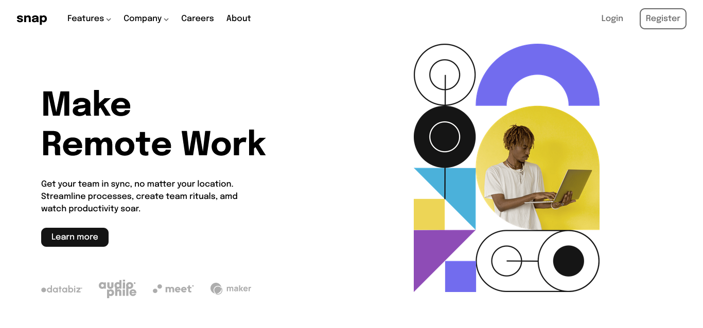
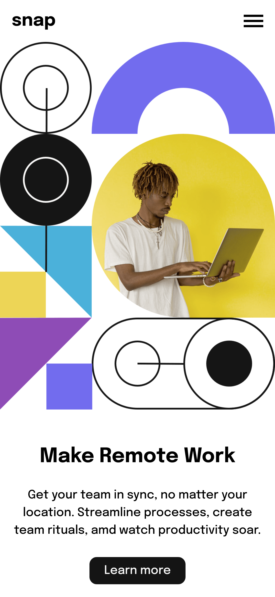

# Frontend Mentor - Intro section with dropdown navigation solution

This is a solution to the [Intro section with dropdown navigation challenge on Frontend Mentor](https://www.frontendmentor.io/challenges/intro-section-with-dropdown-navigation-ryaPetHE5). Frontend Mentor challenges help you improve your coding skills by building realistic projects.

## Table of contents

- [Overview](#overview)
  - [The challenge](#the-challenge)
  - [Screenshot](#screenshot)
  - [Links](#links)
- [My process](#my-process)
  - [Built with](#built-with)
  - [What I learned](#what-i-learned)
  - [Continued development](#continued-development)
- [Author](#author)

## Overview

### The challenge

Users should be able to:

- View the relevant dropdown menus on desktop and mobile when interacting with the navigation links
- View the optimal layout for the content depending on their device's screen size
- See hover states for all interactive elements on the page

### Screenshot




### Links

- Solution URL: [Github Repository](https://github.com/WadieBenabdouh/intro-section-with-dropdown-navigation-main)
- Live Site URL: [In-Action Site](https://sss-remote-wadie-ceo.netlify.app/)

## My process

This is my first project where I use Javascript too deeply, I started by making the website look good on large screens, then I switched to mobile workflow, I usually prefer mobile-first workflow but in this case I had to use Javascript in a way that I will be learning how it works.
I started by setting a basic CSS reset as well as creating custom varibales for SCSS "$".

### Built with

- Semantic HTML5 markup
- Flexbox
- CSS Grid
- SCSS
- NodeJS NPM Parcel Bundler
- Pure Javascript

### What I learned

I finally learned how to implement the famous burger menu for the first time.

```html
<h1>Some HTML code I'm proud of</h1>
  <!-- BURGER -->
        <button id="menu-toggle" aria-label="Menu">
            <span></span>
            <span></span>
            <span></span>
        </button>
        <!-- BURGER END -->
```

```css
 #menu-toggle {
            display: flex;
            flex-direction: column;
            align-items: center;
            background: transparent;
            border: none;
            cursor: pointer;
            gap: 4px;
            z-index: 100;

            span {
                display: block;
                height: 3px;
                background: #000;
                width: 2em;
                transition: all 0.3s;
            }
        }
```

```js
const menu_btn = document.querySelector("#menu-toggle");
const mobile_menu = document.querySelector(".mobile-nav");

menu_btn.onclick = () => {
  menu_btn.classList.toggle("is-active");
  mobile_menu.classList.toggle("in-action");
};
```

### Continued development

I will be looking forward to learning how to make mobile nav dropdown expand smoothly

## Author

- Frontend Mentor - [@WadieBenabdouh](https://www.frontendmentor.io/profile/WadieBenabdouh)
